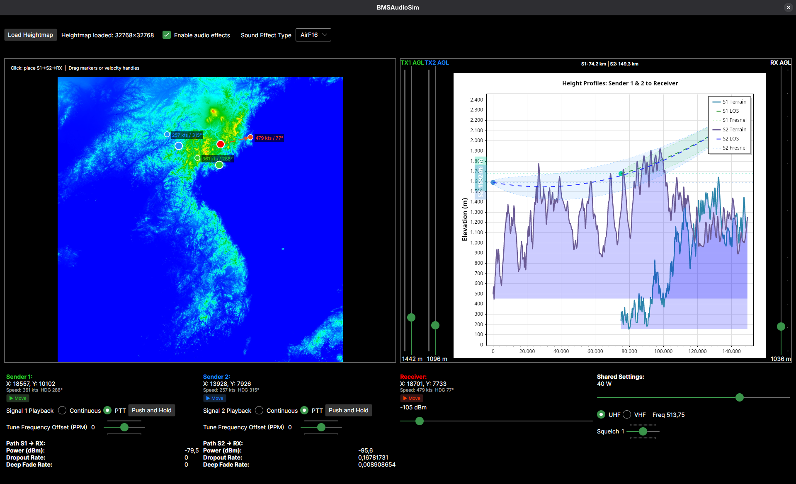

# OpenFreqAudio

Physics-based radio communication simulation for flight simulators, primarily targeting Falcon BMS.
Models radio propagation over terrain and AM radio demodulation.


## Features

### RF Propagation Physics

Radio frequency propagation modeling based on ITU-R standards:

- **Delta-Bullington terrain diffraction** (ITU-R P.526-16, ERDC/CRREL TR-22-1) for terrain obstruction
- **Two-ray sea reflection model** with curved-Earth geometry (ITU-R P.528-5) for multipath fading over water.
  - Sea surface roughness from the Ament / Miller-Brown factor
- **Fresnel zone clearance** for path obstruction
- **Atmospheric refraction** using altitude-dependent refractivity (SAND2012-10690)
- **Doppler shift** from transmitter and receiver velocities

### Audio Processing

Baseband simulation of
[AM demodulation](https://en.wikipedia.org/wiki/Envelope_detector#AM_demodulation), with realistic:
- Radio bandwidth and filtering
- Automatic gain control and squelch based on received signal power
- Interference from multiple simultaneous transmitters, with "stepped-on" tones from
  mistuned or Doppler-shifted carriers

Demo: <https://youtu.be/Sxe9OoFJ44g>

### Background Noise

Frequency-appropriate ambient noise based on radio type:

#### Radio Type-Specific Noise
- **VHF AM**: Crackling static with atmospheric pops
  - Pink noise base with crackles (10-20 events/second)
  - Exponentially decaying envelopes (1-4ms)
- **UHF AM**: Lighter crackling, reduced atmospheric interference

#### Sender-Specific Ambient
- **Cockpit**: Engine rumble, avionics hum, airflow
- **Ground vehicle**: Engine and movement sounds
- **Stationary station**: Clean radio room ambiance

## Architecture

### Projects

#### OpenFreqAudio

Core audio engine library providing:
- RF propagation simulation (`FastPathAudioSim`)
- Audio effects processing (`RadioEffect`)
- Real-time mixing and playback (`RadioPlayback`, `RadioMixer`)
- Background noise generation (`BackgroundNoiseGenerator`)
- DEM (Digital Elevation Model) terrain integration

#### BMSAudioSim
Demo application for testing and visualization:
- **Avalonia UI** cross-platform interface
- **2 transmitters + 1 receiver** simulation
- **BMS heightmap integration** for terrain-based propagation
- **3D position simulation** with velocity controls
- **Heterodyne testing**: adjustable PPM offset

Allows testing of Doppler effects, terrain diffraction, multipath interference, and distance-dependent propagation.

### Technology Stack

- **.NET 10.0**
- **BASS Audio Library** (ManagedBass, ManagedBass.Mix)
- **Avalonia 11.3**

## Building

### Prerequisites
- .NET 10.0 SDK
- [BASS v2.4](https://www.un4seen.com/) audio library (native DLLs/SOs included in Assets/)  

### Windows
```bash
dotnet build OpenFreqAudio.sln -c Release
```

### Linux
```bash
dotnet build OpenFreqAudio.sln -c Release
```

Native BASS libraries are automatically copied from `Assets/windows/` or `Assets/linux/` depending on the target platform.

## Running BMSAudioSim

```bash
# Windows
.\BMSAudioSim\bin\Release\net10.0\win-x64\BMSAudioSim.exe

# Linux
./BMSAudioSim/bin/Release/net10.0/linux-x64/BMSAudioSim
```

### Demo Features
- Load BMS theater heightmap (.DEM format)
- Position two transmitters and one receiver
- Adjust frequency, power, and PPM offsets
- Test heterodyne effects with same-frequency transmissions
- Visualize terrain profile along propagation path

## Physics References

- **ITU-R P.526-16**: Propagation by diffraction (knife-edge and smooth-Earth diffraction)
- **ITU-R P.528-5**: A propagation prediction method for aeronautical mobile and radionavigation
  services using the VHF, UHF and SHF bands (two-ray divergence, ray-length factor, and unity cap)
- **ITU-R P.452-18**: Prediction procedure for the evaluation of interference between stations
  on the surface of the Earth at frequencies above about 0.1 GHz (diffraction-corrected smooth heights)
- **ITU-R P.372**: Radio noise (external noise level and slope)
- **ITU-R P.676-8**: Attenuation by atmospheric gases (why gas absorption is omitted)
- **ITU-R P.838-3**: Specific attenuation model for rain for use in prediction methods
  (why rain attenuation is omitted)
- **ERDC/CRREL TR-22-1**: D. J. Breton, *A Study on the Delta-Bullington Irregular Terrain
  Radiofrequency Propagation Model* (U.S. Army ERDC, 2022)
- **SAND2012-10690**: A. W. Doerry, *Earth Curvature and Atmospheric Refraction Effects on
  Radar Signal Propagation* (Sandia National Laboratories, 2013)
- **Kerr (1951)**: *Propagation of Short Radio Waves* (classic grazing-angle divergence factor)
- **Ament; Miller & Brown**: Rough-surface specular reflection factor (sea surface roughness)
- **ETSI ETS 300 676**: VHF aeronautical AM radio equipment (AM modulation depth)

## License

Mozilla Public License Version 2.0 (MPLv2)
